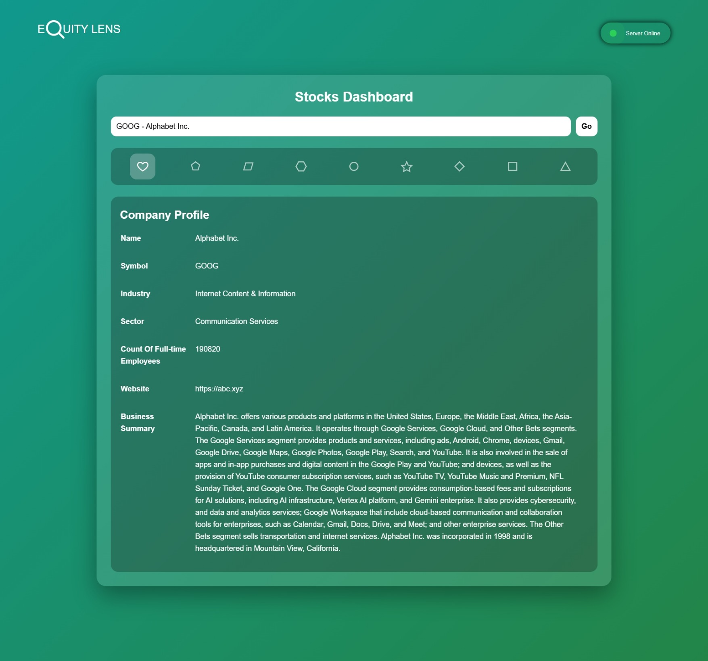
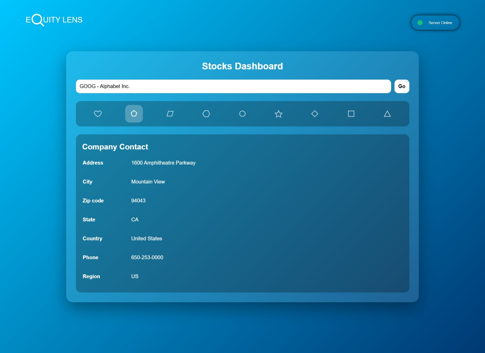
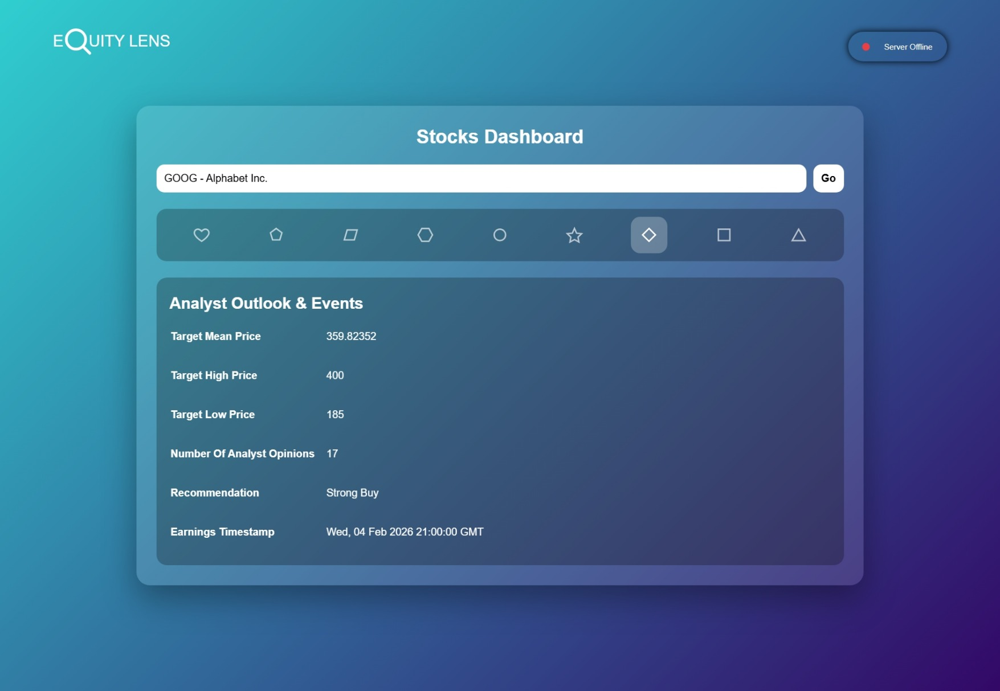
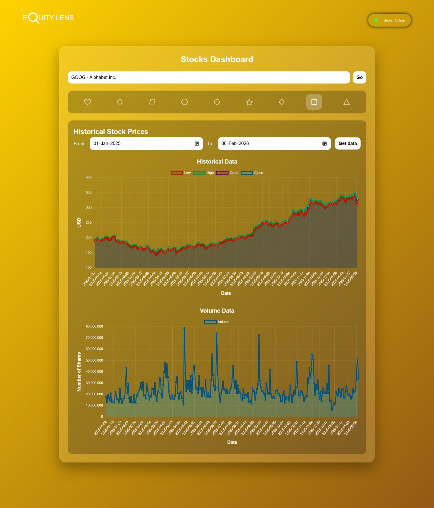
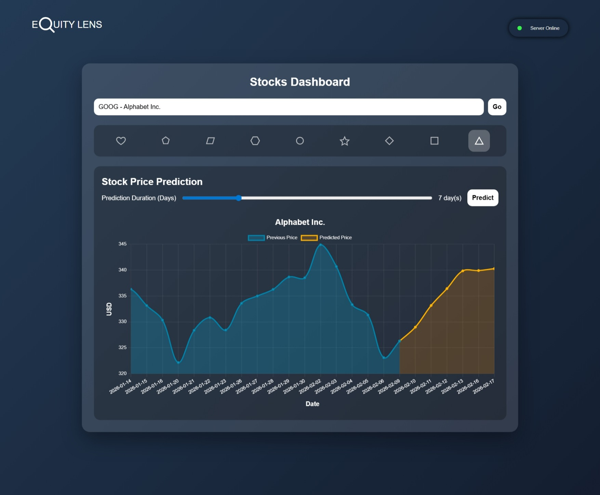

# EQUITY LENS

A full-featured Stock Analytics Dashboard that provides users with detailed company fundamentals, valuation metrics, analyst outlook, historical stock price visualization, and machine learning–based stock price forecasting.

This project allows users to explore stocks interactively and predict future prices for up to 30 days ahead using a Random Forest Regression model, with plans to integrate LSTM deep learning forecasting in future updates.

# Features
This application provides stock information grouped into the following sections:  
1. **Company Overview**: Users can view detailed company profile information including *company name*, *ticker symbol*, *industry & sector*, *number of full-time employees*, *website* and *business summary*.

2. **Company Contact Information**: Includes company headquarters details like *address*, *city*, *state*, *zip code*, *country & region*, *phone number*.

3. **Stock Price Snapshot**: Displays key real-time stock price indicators like *current price*, *open & previous close*, *day high / day low*, *52-week high / low*, *volume & average volume*.
4. **Valuation Metrics**: Provides important valuation ratios such as *market capitalization*,*trailing PE / forward PE*, *price-to-book*, *price-to-sales*, *PEG Ratio*.
5. **Financial Performance & Growth**: Tracks company financial health including *total revenue*, *net income*, *revenue growth*, *earnings growth*,*profit margins*, *return on equity (ROE)*.
6. **Dividends & Shareholder Returns**: Shows dividend-related metrics like *dividend rate & yield*, *payout ratio*, *ex-dividend date*, *last dividend value*.
7. **Analyst Outlook & Events**: Displays analyst recommendations and earnings events like target mean / high / low price*, *analyst opinion count*, *recommendation summary*, *earnings timestamp*.

8. **Historical Stock Data**: Users can visualize historical stock performance over five variables namely, *open*, *close*, *high*, *low*, *volume*.

9. **Stock Price Prediction**: The dashboard includes an ML-based forecasting module through which a user can predict stock prices for the next 1 to 30 days.


## Prediction models
| Model | MAE | RMSE | R2 Score |
|-------|-----|------|----------|
| Random Forest Regressor | 0.0272 | 0.0433 | 0.9474 |

## Installation & Setup
### 1. Clone the Repository
```bash
git clone https://github.com/mohammad-azam22/equity-lens.git
```

### 2. Move to the directory
```bash
cd equity-lens
```

### 3. Create Virtual Environment
```bash
python -m venv venv
source venv/bin/activate     # Mac/Linux
venv\Scripts\activate        # Windows
```

### 4. Install Dependencies
```bash
pip install -r requirements.txt
```

### 5. Run the Application
```bash
python app.py                                       # Development server
waitress-serve --host=0.0.0.0 --port=9696 app:app  # Production server
```

The app will start on: `http://127.0.0.1:9696/`

## License

This project is licensed under the MIT License.

## Disclaimer

This application is for educational purposes only and does not provide financial advice.
The author is not liable for any losses incurred from using the predictions or data shown in this dashboard.
